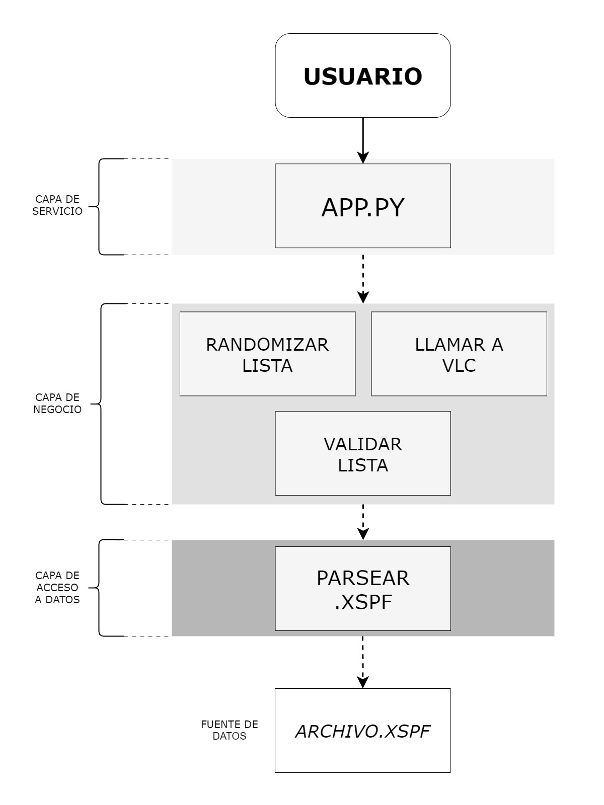
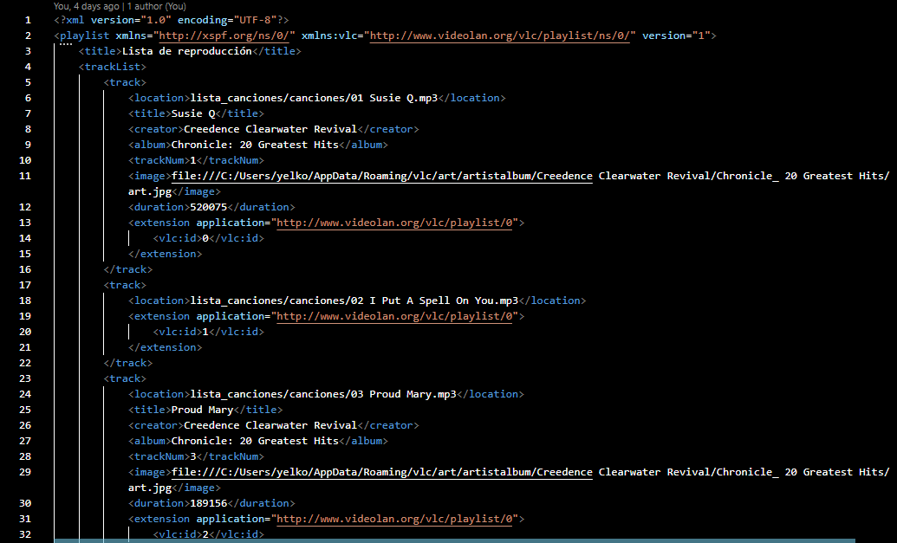
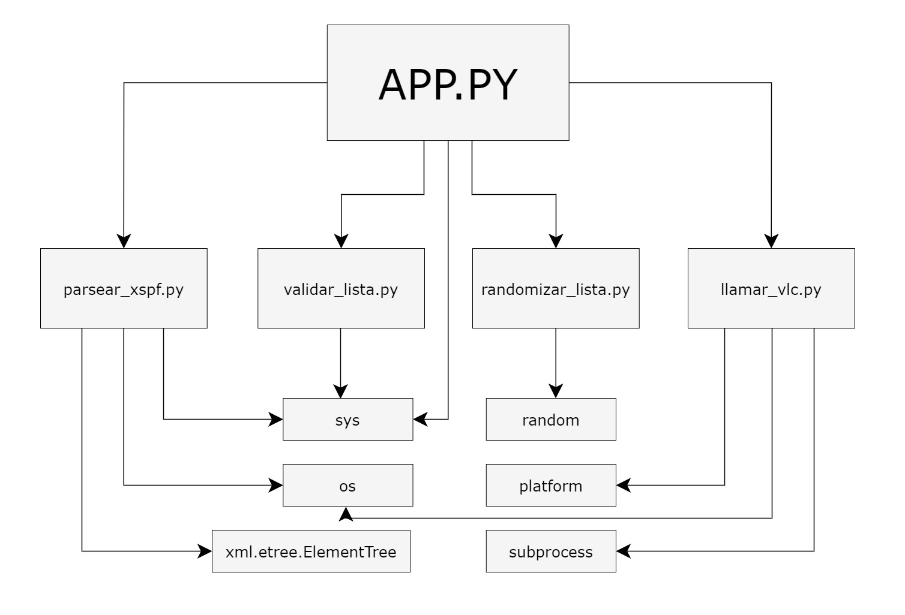
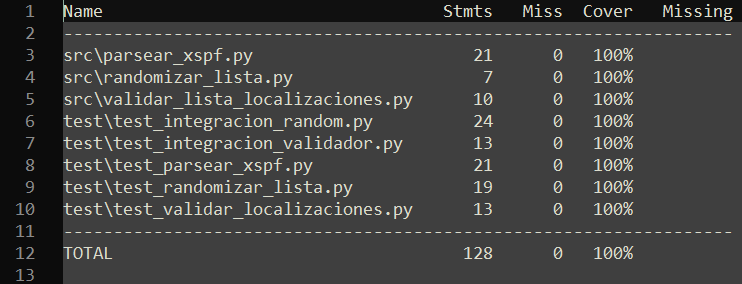
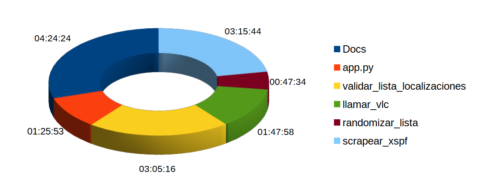
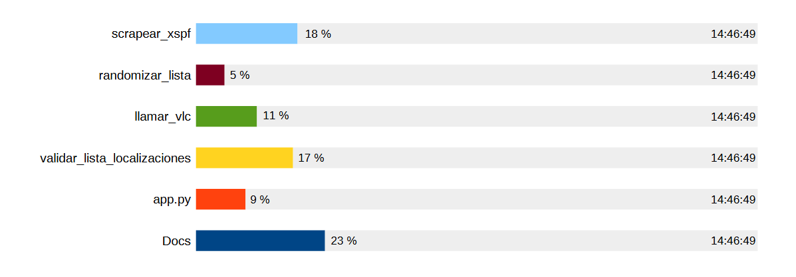

# **RetoVLC**

**Índice**
- [**Introducción**](#Introducción)
- [**Manual de Uso**](#manual-de-uso)
    -   [**Pre-requisitos**](#pre-requisitos)
    -   [**Instalación**](#instalación)
    -   [**Uso**](#uso)
- [**Metodología**](#metodología)
    - [**Uso de Git**](#uso-de-git)
        - [**Ramas principales**](#ramas-principales)
        - [**Flujo de trabajo**](#flujo-de-trabajo)
    - [**Programación defensiva**](#programación-defensiva)
- [**Descripción técnica**](#descripción-técnica)
    - [**Arquitectura de la aplicación**](#arquitectura-de-la-aplicación)
    - [**Ejemplo de archivo xspf**](#ejemplo-de-archivo-xspf)
- [**Diseño**](#diseño)
- [**Implementación**](#implementación)
- [**Test**](#test)
    - [**Coverage**](#coverage)
- [**Tiempo de trabajo**](#tiempo-de-trabajo)
- [**Conclusiones**](#conclusiones)
    - [**Posibles mejoras**](#posibles-mejoras)
    - [**Dificultades**](#dificultades)

# **Introducción**

Este proyecto, desarrollado por Yelko Veiga Quintas, parte del curso de 1º de Programación en DAM a propuesta de David Gelpi @dfleta.

La finalidad es desarrollar un software capaz de generar una lista de reproducción de canciones de manera aleatoria y activar la reproducción a través de VLC. 

No se empleará base de datos, sino que en su lugar el acceso a datos se llevará a cabo mediante un archivo .xspf. En esta solución en particular, se dispondrá de un directorio en el que cualquier usuario pueda depositar su archivo .xspf para que sea incluido y reproducido en VLC.

Se ha utilizado como lenguaje de programación Python (versión 3.11.5) para la lógica de la aplicación.


# **Manual de uso**
## **Pre-requisitos**

-   `Git`
-   `Python3`
-   `pip3`
-   `VLC`

## **Instalación**

###  Para usuarios de **Windows**:
1. **Instalar Python**.

    Descargamos e instalamos Python desde [python.org](https://www.python.org/downloads/). Nos aseguramos de marcar la opción "Add Python to PATH" durante la instalación.
2. **Clonar el proyecto desde Git**.

    Desde un terminal (cdm o powershell, por ejemplo), nos situamos en el directorio donde vamos a clonar nuestro proyecto y ejecutamos:
    ```
    $ git clone https://github.com/yelkov/retoVLC.git
    ```
    Esto clonará el proyecto en tu directorio actual.
3. **Crear y activar un entorno virtual**.

    Primero nos colocamos en el directorio recién creado. A continuación creamos y activamos un entorno virtual:
    ```
    $ cd retoVLC
    $ python -m venv venv
    $ .\venv\Scripts\activate
    ```
    Esto creará un entorno virtual y lo activará.
4. **Instalar las dependencias**:
    ```
    $ pip install -r requirements.txt
    ```
5. En caso de no tener instalado el **reproductor VLC** en el equipo, podemos descargar el setup de [la página de VLC](https://www.videolan.org/vlc/download-windows.es.html) y ejecutarlo, manteniendo la instalación por defecto.

    El programa va a buscar el ejecutable de VLC en la ruta *C:\Program Files (x86)\VideoLAN\VLC\vlc.exe* o en su defecto en *C:\Program Files\VideoLAN\VLC\vlc.exe* . Si este no se encuentra instalado en alguna de esas rutas se enviará un mensaje de error.
6. Después de ejecutar el programa, si queremos **desactivar el entorno virtual**:
    ```
    $ deactivate
    ```


###  Para usuarios de **Linux**:
1. **Instalar Python**.

    En la mayoría de las distribuciones de Linux, Python ya está instalado. Si no lo está, lo instalamos a través del gestor de paquetes de nuestra distribución en particular.
2. **Clonar el proyecto desde Git**.

    Desde un terminal:
    ```
    $ git clone https://github.com/yelkov/retoVLC.git
    ```
3. **Crear y activar un entorno virtual**.

    Primero nos colocamos en el directorio recién creado. A continuación creamos y activamos un entorno virtual:
    ```
    $ cd retoVLC
    python3 -m venv venv
    source venv/bin/activate
    ```
4. **Instalar las dependencias**.
    ```
    $ pip install -r requirements.txt
    ```
5. En caso de no tener instalado el **reproductor VLC** en el equipo:
    ```
    $ sudo apt install vlc
    ```
    El programa va a buscar el ejecutable de VLC en la ruta */usr/bin/vlc* o en su defecto en */snap/bin/vlc* . Si este no se encuentra instalado en alguna de esas rutas se enviará un mensaje de error.

6. Después de ejecutar el programa, si queremos **desactivar el entorno virtual**:
    ```
    $ deactivate
    ```

## **Uso**
Podemos reproducir una de las listas creadas en el directorio **lista_canciones** o bien depositar nuestra lista de canciones en formato .xspf en ese directorio en particular para ser reproducida. 

Por defecto tendremos dos listas válidas para reproducir, que son 'creedence.xspf' y 'lista_prueba.xspf'. Las canciones de estas dos listas se encuentran en el subdirectorio **canciones** (lista_canciones/canciones). Si el usuario quiere ejecutar su propia lista no necesita añadir las canciones a este subdirectorio, siempre que la ruta a las canciones se encuentre en el propio equipo y que el archivo .xspf se encuentre en un formato válido.

El programa siempre va a exigir el nombre de la lista a reproducir. En caso de error en la escritura,error de formato del archivo o falta del nombre de la lista, se le indicará al usuario cual es el error para que pueda subsanarlo.

1. **Abrimos un terminal**.
    
    - **Windows**:
    ```
    $ app.py creedence.xspf
    ```

    - **Linux**:
    ```bash
    $ python3 app.py creedence.xspf
    ```
    Debemos aseguramos de estar situados en el directorio raíz (retoVLC). Si el usuario quiere introducir su propia lista, cambiamos 'creedence.xspf' por el nombre de la lista deseada (incluida la extensión .xspf)
    
2. Para detener la reproducción, **cerramos VLC**.

    En caso de querer reproducir de nuevo una lista, repetimos el proceso anterior desde el terminal. 

# Metodología

## **Uso de Git**
 Este proyecto sigue una metodología de desarrollo incremental basada en ramas que facilita la gestión de versiones y la colaboración entre desarrolladores. A continuación, se detalla el flujo de trabajo.

### Ramas Principales

- **`main`**: La rama *main* representa la versión estable y lista para producción del proyecto. Cada versión estable se etiqueta con un número de versión. Actualmente, la primera y última versión estable es la **1.0.0**.

- **`develop`**: La rama *develop* es la rama principal de desarrollo. Todas las nuevas características y desarrollos se realizan en esta rama. Es importante destacar que esta rama nunca debe considerarse como una versión estable del proyecto.

### Flujo de Trabajo

1. **Nueva Funcionalidad**: Cuando se trabaja en una nueva funcionalidad o característica, se hace en la rama `develop`. 

2. **Desarrollo y Commits**: Realizamos los cambios y commits en esta misma rama. Siempre tratamos de hacer commits pequeños, descriptivos y utilizando el sistema de Conventional Commits.

    ```
    git add .
    git commit -m "tipo(alcance): añadir XYZ"
    ```

3. **Pruebas Locales**: Realizamos pruebas locales para asegurarnos de que la nueva funcionalidad funciona como se espera. Para ello utilizamos el marco de pruebas para python **Pytest**.

4. **Merge con `main`**: Una vez que la funcionalidad está completa y probada, realizamos un merge con la rama `develop`.

    ```
    git checkout main
    git merge --no-ff develop
    ```

5. **Resolución de Conflictos (si es necesario)**: Si hubiese conflictos durante el merge, los resolvemos manualmente y realizamos un commit adicional.

6. **Push a `develop`**: Subimos los cambios a la rama *develop* en el repositorio remoto.

    ```
    git push origin develop
    ```

7. **Release**: Una vez realizado el merge en `main`, ya sea una nueva funcionalidad o un patch de errores, podemos añadir una nueva etiqueta a esta rama que indique la versión en la que nos encontramos.
    ```
    $ git tag -a x.y.z -m "Versión x.y.z"
    ```
    Con -a creamos la etiqueta 'x.y.z' (sustituyendo por los números que correspondan) y asociamos un mensaje.

    Finalmente subimos la etiqueta al repositorio remoto:
    ```
    $ git push origin 1.0.0
    ```
## **Programación defensiva**
Se utiliza esta estrategia para gestionar errores previsibles en la entrada de datos y aumentar robustez del código así como validaciones en puntos críticos que eviten la propagación de defectos no esperados. Se implementa a través del manejo de excepciones y programación por contrato.

- **Manejo de excepciones** : se aplica tanto en el módulo [`parsear_xspf`](#parsear_xspf)  (ET.ParseError y FileNotFoundError) como en [`llamar_vlc`](#llamar_vlc) (FileNotFoundError), para detectar y gestionar errores como archivos corrompidos que no se puedan parsear, archivos no encontrados o bien ruta no encontrada para vlc.

 - **Programación por contrato** : se implementa en los módulos [`validar_lista_localizaciones`](#validar_lista_localizaciones) y [`randomizar_lista`](#randomizar_lista). En este sentido, la programación defensiva se aplica mediante la verificación de tipos en las precondiciones (que sea una lista) y validación de contenido en las postcondiciones (mantener el input como invariante y tipo de los datos de salida).

# **Descripción técnica**
## **Arquitectura de la aplicación**


- **Capa de servicio** 
    -   **app.py** - programa principal.

- **Capa de negocio**
    
    -   **llamar_vlc.py**: ejecuta VLC con una lista de reproducción dada según el sistema operativo, validando la existencia del ejecutable de VLC.

    -   **randomizar_lista.py** : toma una lista como entrada,  reordena sus elementos de manera aleatoria y la devuelve.
    
    -   **validar_lista.py** : verifica si la lista de localizaciones de canciones contiene cadenas no vacías y devuelve la lista validada.

- **Capa de acceso a datos**
    -   **parsear_xspf.py** : lee un archivo XSPF, parsea sus elementos XML y devuelve una lista de localizaciones de canciones.

### Ejemplo de archivo XSPF



## **Diseño**

#### `parsear_xspf` :
 Lee un archivo XSPF y lo parsea utilizando xml.etree.ElementTree, extrayendo las localizaciones de canciones y devolviendo una lista. Maneja errores como archivos vacíos (o que no se pueden parsear) o archivos no encontrados.
    
#### `validar_lista_localizaciones` :
 Asegura que una lista de localizaciones sea válida, comprobando que sea una lista de cadenas no vacías, y la devuelve si cumple con las condiciones de validación.

#### `randomizar_lista` :
Duplica y reordena aleatoriamente los elementos de una lista, validando que todos los elementos originales estén presentes en la lista reordenada.

#### `llamar_vlc` :
Ejecuta VLC con una lista de reproducción, considerando el sistema operativo y validando la existencia del ejecutable de VLC en rutas predefinidas.

# **Implementación**
## **Tecnologías y Herramientas Elegidas**

- [**Python**](https://docs.python.org/3/):

    [`xml.etree.ElementTree`](https://docs.python.org/3/library/xml.etree.elementtree.html): Librería que permite parsear y manipular archivos XML, utilizado aquí para extraer información de un archivo XSPF.

    [`os`](https://docs.python.org/3/library/os.path.html#os.path.dirname): Librería que proporciona funciones para interactuar con el sistema operativo, usado para gestionar rutas y directorios en el proyecto.

    [`sys`](https://docs.python.org/3/library/sys.html): Librería utilizada para manejar la salida del sistema, especialmente para salir del programa con códigos de estado.

    [`platform`](https://docs.python.org/es/3.10/library/platform.html): Librería con la que se determina el sistema operativo actual, permitiendo adaptar el comportamiento del código según la plataforma.

    [`random`](https://docs.python.org/es/3/library/random.html): Librería utilizada para reordenar aleatoriamente los elementos de una lista, en este caso, para randomizar la lista de reproducción de canciones.

    [`subprocess`](https://docs.python.org/3/library/subprocess.html): Librería que facilita la ejecución de comandos del sistema operativo, aquí usado para llamar a VLC y reproducir la lista de reproducción generada.

    [`pytest`](https://docs.pytest.org/en/7.1.x/how-to/assert.html) : Framework utilizado para escribir casos test

    [`coverage`](https://coverage.readthedocs.io/en/6.2/): Herramienta para medir el código de un programa cubierto por los test.

    [`pip`](https://packaging.python.org/en/latest/) : administrador de paquetes en Python que simplifica la instalación, actualización y gestión de bibliotecas y paquetes.

- [**Miniconda3**](https://docs.conda.io/projects/miniconda/en/latest/) : es una distribución minimalista de Conda, un sistema de gestión de paquetes y entornos para Python, facilitando la administración y distribución de paquetes.
- [**Git**](https://git-scm.com/docs) : sistema de control de versiones distribuido, permite gestionar cambios en el código colaborativamente, rastreando historial y ramificaciones.
- [**Markdown**](https://www.markdownguide.org/) :  lenguaje de marcado ligero para formatear texto de manera simple y legible, ampliamente utilizado en documentación.

# **Test**
Los test realizados se pueden encontrar en la carpeta test.

En el proyecto se utilizan dos tipos de test:
- **Unitarios** : Evalúa un módulo particular de código para verificar su comportamiento y funcionamiento esperado.

    - **test_parsear_xspf.py** : El código contiene `6 tests` que verifican la funcionalidad de obtener_localizaciones para archivos XSPF específicos, incluyendo casos de archivos vacíos o inexistentes.
    
    - **test_validar_localizaciones.py** : cuenta con `2 test`, uno en el que se prueba la salida con archivos erróneos y otro con archivos válidos.

    - **test_randomizar_lista.py** : El código tiene `5 tests` que verifican la funcionalidad de randomizar_lista para diferentes casos, incluyendo listas vacías, conservación de elementos y longitud de los mismos.

- **Integración** : Son test para evaluar la interacción entre múltiples componentes o módulos del software, asegurando su colaboración adecuada.

    - **test_integracion_validador.py** : `2 tests` de integración que evalúan la funcionalidad combinada de obtener_localizaciones y validar_lista_localizaciones. Verifican la validación exitosa y el manejo adecuado de archivos incorrectos o vacíos.

    - **test_integracion_random.py** : `3 tests` de integración que evalúan las funciones combinadas validar_lista_localizaciones, obtener_localizaciones y randomizar_lista. Verifican longitudes y contenidos, asegurando la diversidad y validez de las listas resultantes.

El módulo que llama a VLC no es posible testearlo con código, ya que la comprobación del proceso es la propia ejecución de VLC.

## Coverage
Teniendo en cuenta lo anterior, podemos ver que los test planteados cubren un 100% de nuestro código (hay que tener en cuenta la exclusión del módulo 'llamar_vlc.py'.)



# **Tiempo de trabajo**
## Clockify
Utilizamos **Clockify**, una herramienta de seguimiento de tiempo en línea que ayuda a registrar, analizar y gestionar eficientemente el tiempo dedicado a tareas y proyectos.

El tiempo total empleado es aproximadamente de unas `15 horas` 

La distribución de tiempo entre las distintas partes del proyecto es la que sigue:



# **Conclusiones**
Consideramos que a pesar de que el problema a resolver es relativamente sencillo, el hecho de hacer un trabajo de estas características por primera vez supone un reto del que se ha conseguido sacar mucho provecho de cara al aprendizaje. 

Durante la construcción de los diferentes módulos, su testeo e integración posterior, hemos podido asimilar la razón de aplicar ciertas estructuras y metodologías de trabajo que permiten mantener el desarollo controlado. Han surgido ciertos errores durante la realización del proyecto que sin estas herramientas hubiesen sido más difíciles de identificar y corregir. 

Como conlusión final, independientemente del resultado de la calificación de este reto, resulta motivador comprobar el avance de estos últimos meses en el desarrollo de un software ejecutable y aplicar los conocimientos obtenidos.  


## **Posibles mejoras**

- Leer varias listas de canciones e integrarlas en una sola al ejecutar VLC (es decir, pasar como argumento más de una lista de canciones).
- Posibilidad de que el usuario no necesite guardar un archivo xspf extraído previamente, sino que este se genere a partir de una serie de canciones elegidas por él.


## **Dificultades**

El enfrentarse por primera vez a muchas de las herramientas y metodologías empleadas (Git, programación defensiva), así como sobre todo el trabajo previo de pensar en la estructura y diseño del proyecto han supuesto los mayores desafíos. 

Aunque no se ha reflejado en el tiempo final de trabajo, una parte importante de este fue destinado al uso de Git como herramienta de control de versiones para tratar de mantener un flujo de desarrollo lo más legible posible. 

Los módulos en los que más tiempo se ha empleado son parsear_xspf y validar_localizaciones:
- En el primer caso la dificultad se encontraba en la manera acceder a los datos necesarios para desarrollar el proyecto, cómo introducir el archivo requerido como argumento indicando la ruta adecuada y como manejar los posibles errores que pueden surgir de la lectura de ese archivo.
- Por otro lado, el desarollo de este módulo surge de la idea de crear una barricada de saneamiento para la entrada de datos, si bien más tarde se optó por gestionar los errores de lectura en el módulo de parsear. Este segundo módulo se utilizó entonces para comprobar la validez de los datos extraidos en el módulo anterior, y es posible que en posteriores desarrollos se pudiese ampliar este mismo para una mejor obtención de datos válidos.

Otra de las dificultades se encontró en la creación de los test, a pesar de que tampoco se refleja de todo en los esquemas de tiempo. La mayor dificultad ha sido el testeo de los casos en los que intervienen las excepciones, comprendender la sintaxis para que pytest detecte que esa excepción está gestionada. Además hay algunas partes del trabajo que podrían estar mejor testeadas, en particular no se encontró una solución óptima al testeo del módulo que ejecuta VLC. Se pudo probar la validez del programa para Windows y para Linux, si bien para sistemas operativos de Apple no tenemos ningún tipo de feedback.

Por último, la cuestión de las dependencias del proyecto es la que más dudas nos genera una vez entregado este, y es un tema en el que necesariamente tendremos que indagar y mejorar a futuro.  